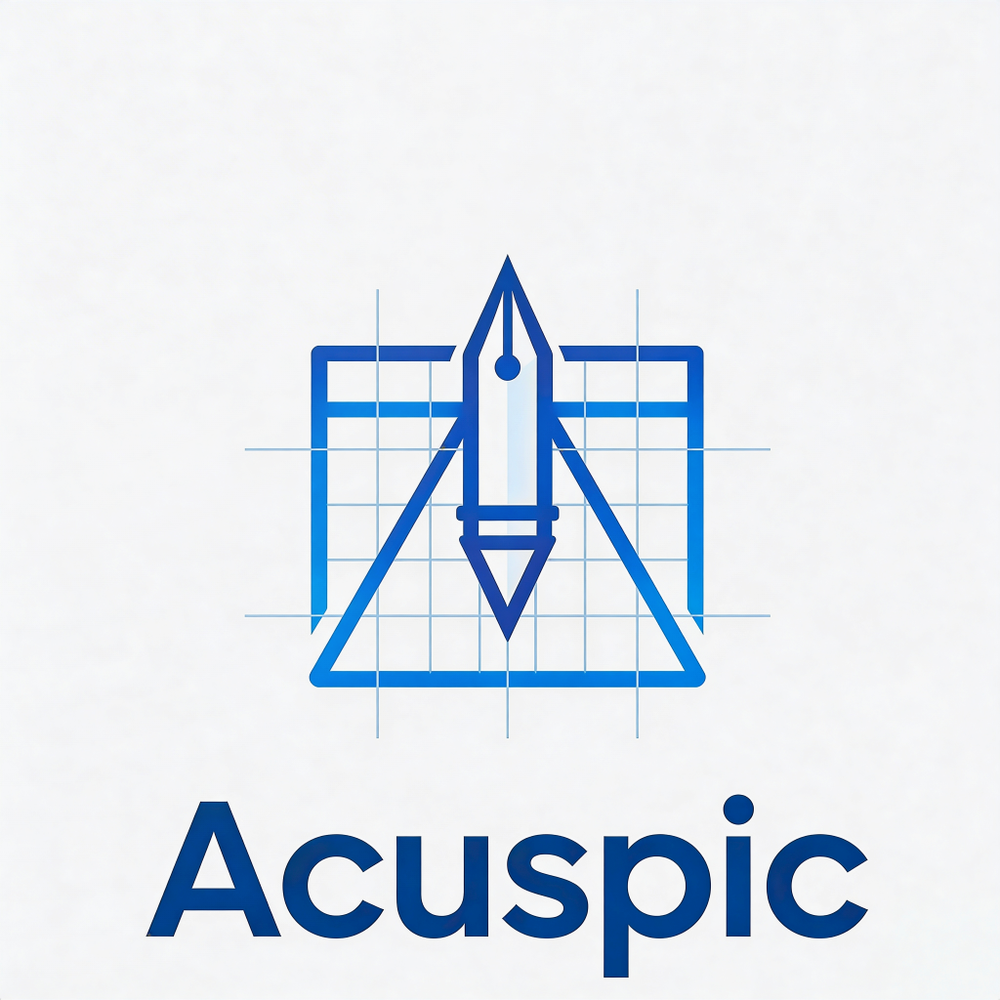
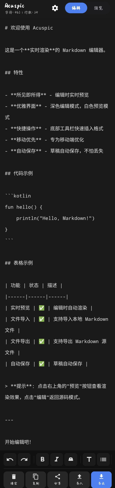
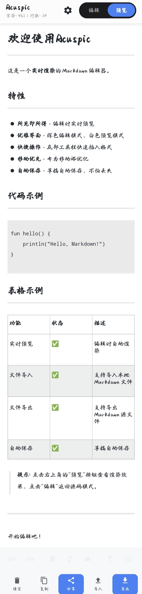
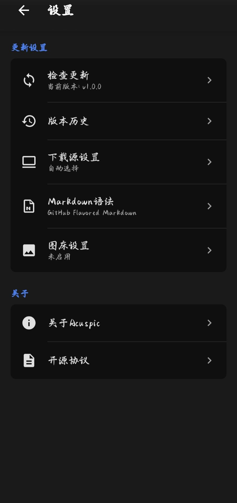

<p align="center">
  <a href="https://github.com/Jay-Victor/Acuspic">
    
  </a>
</p>

<h1 align="center">Acuspic</h1>

<p align="center">
  <strong>精准 · 清晰 · 专注</strong>
</p>

<p align="center">
  <em>一款为移动端打造的轻量级 Markdown 编辑器</em>
</p>

<p align="center">
  <a href="#-功能特性">功能特性</a> •
  <a href="#-下载安装">下载安装</a> •
  <a href="#-使用指南">使用指南</a> •
  <a href="#-许可证">许可证</a> •
  <a href="#-支持项目">支持项目</a>
</p>

<p align="center">
  <a href="#english-version"><strong>English</strong></a> | 
  <a href="https://github.com/Jay-Victor/Acuspic/releases"><strong>下载 Download</strong></a>
</p>

<p align="center">
  
  
  
  
  
  
</p>

<p align="center">
  <strong>支持 6 种 Markdown 方言</strong> • 
  <strong>集成 6 种图床服务</strong> • 
  <strong>本地存储 · 离线可用</strong>
</p>

---

## 目录

- [项目简介](#项目简介)
- [名称由来](#名称由来)
- [功能特性](#功能特性)
- [截图预览](#截图预览)
- [下载安装](#下载安装)
- [使用指南](#使用指南)
- [技术架构](#技术架构)
- [项目结构](#项目结构)
- [开发环境](#开发环境)
- [更新日志](#更新日志)
- [许可证](#许可证)
- [支持项目](#支持项目)
- [贡献指南](#贡献指南)
- [联系方式](#联系方式)
- [致谢](#致谢)

---

## 项目简介

**Acuspic** 是一款专为 Android 平台设计的 Markdown 编辑器，致力于为移动端用户提供**精准、清晰、专注**的写作体验。

### 为什么选择 Acuspic？

在移动设备上写作，往往面临屏幕空间有限、输入效率低、排版困难等挑战。Acuspic 从用户实际需求出发，打造了一套完整的移动端 Markdown 解决方案：

| 痛点 | Acuspic 解决方案 |
|------|------------------|
| 屏幕小，编辑困难 | 精简界面，专注写作，工具栏一键插入 |
| 图片管理麻烦 | 内置 6 种图床，一键上传自动获取链接 |
| 格式不统一 | 支持 6 种 Markdown 方言，按需切换 |
| 担心数据隐私 | 本地存储，离线可用，数据完全由你掌控 |
| 更新检查繁琐 | 双源更新系统，自动检测，一键下载 |

### 适用人群

- 📝 **内容创作者** - 博客写作、公众号排版、自媒体内容创作
- 💻 **开发者** - 技术文档编写、README 撰写、开源项目维护
- 🎓 **学生/研究者** - 学术笔记、论文草稿、知识整理
- 📱 **移动办公族** - 随时随地记录灵感、会议纪要、工作日志

---

## 名称由来

**Acuspic** 是一个精心设计的名称，融合了两个拉丁语词根，完美诠释了产品的核心理念：

| 词根 | 来源 | 含义 | 对应产品特性 |
|------|------|------|--------------|
| **Acu-** | 拉丁语 *acutus* | 锐利、敏锐、精准 | Markdown 用精准的纯文本符号控制格式，告别繁冗的富文本按钮 |
| **-spic** | 拉丁语 *specere* | 观看、清晰可见、洞察 | 编辑器将代码符号转化为清晰优美的视觉排版，所见即所得 |

### 设计理念

> **用精准的纯文本符号控制格式，转化为清晰优美的视觉排版**

在移动端局促的屏幕上写作，正需要像针尖一样的精准控制，直击创作者的灵感穴位，没有一丝多余的臃肿功能。

### 品牌特色

- 🎯 **极简主义** - 没有冗余功能，只专注于写作本身
- ⚡ **轻量高效** - 6MB 安装包，秒开启动，流畅运行
- 🔒 **隐私优先** - 本地存储，不收集用户数据
- 🌐 **开源精神** - 欢迎社区贡献，共同完善

---

## 功能特性

### 📝 强大的 Markdown 支持

支持 **6 种 Markdown 方言**，满足不同场景需求：

| 方言 | 说明 | 适用场景 | 特殊语法 |
|------|------|----------|----------|
| **GFM** | GitHub Flavored Markdown | GitHub 文档、开源项目、Issue/PR | 任务列表、表格、自动链接、删除线 |
| **CommonMark** | 标准规范 | 跨平台兼容、通用文档 | 严格规范、可预测渲染 |
| **Original** | 经典 Markdown | 简洁纯净、基础写作 | 原始语法、最小化扩展 |
| **MultiMarkdown** | 扩展 Markdown | 学术写作、脚注支持、引用管理 | 脚注、引用、元数据、数学公式 |
| **Markdown Extra** | PHP Markdown Extra | 表格增强、定义列表、脚注 | 定义列表、表格类、脚注 |
| **Pandoc** | Pandoc Markdown | 格式转换、高级排版、学术出版 | YAML 元数据、引用文献、数学 |

**支持的语法特性：**

<details>
<summary>📋 点击查看完整语法支持列表</summary>

| 语法类型 | GFM | CommonMark | Original | MultiMarkdown | Markdown Extra | Pandoc |
|----------|:---:|:----------:|:--------:|:-------------:|:--------------:|:------:|
| 标题 (H1-H6) | ✅ | ✅ | ✅ | ✅ | ✅ | ✅ |
| 粗体/斜体 | ✅ | ✅ | ✅ | ✅ | ✅ | ✅ |
| 删除线 | ✅ | ❌ | ❌ | ✅ | ✅ | ✅ |
| 有序/无序列表 | ✅ | ✅ | ✅ | ✅ | ✅ | ✅ |
| 任务列表 | ✅ | ❌ | ❌ | ❌ | ❌ | ✅ |
| 代码块 | ✅ | ✅ | ✅ | ✅ | ✅ | ✅ |
| 语法高亮 | ✅ | ❌ | ❌ | ✅ | ❌ | ✅ |
| 引用块 | ✅ | ✅ | ✅ | ✅ | ✅ | ✅ |
| 表格 | ✅ | ❌ | ❌ | ✅ | ✅ | ✅ |
| 链接/图片 | ✅ | ✅ | ✅ | ✅ | ✅ | ✅ |
| 自动链接 | ✅ | ✅ | ❌ | ✅ | ✅ | ✅ |
| 脚注 | ❌ | ❌ | ❌ | ✅ | ✅ | ✅ |
| 定义列表 | ❌ | ❌ | ❌ | ✅ | ✅ | ✅ |
| HTML 标签 | ✅ | ❌ | ✅ | ✅ | ✅ | ✅ |

</details>

### 🖼️ 图床集成

内置 **6 种图床服务**，一键上传图片，告别图片托管烦恼：

| 图床 | 特点 | 访问速度 | 免费额度 | 配置难度 |
|------|------|----------|----------|----------|
| **Gitee** | 国内平台，免费稳定 | 🇨🇳 国内极速 | 1GB/仓库 | ⭐ 简单 |
| **GitHub** | 全球通用，免费存储 | 🌍 全球可访问 | 1GB/仓库 | ⭐ 简单 |
| **七牛云** | 专业云存储，CDN 加速 | 🚀 高速稳定 | 10GB/月 | ⭐⭐ 中等 |
| **SM.MS** | 免费图床，无需注册 | 🌐 全球节点 | 5GB | ⭐ 简单 |
| **Imgur** | 国际知名，社区活跃 | 🌍 海外优选 | 无限制 | ⭐ 简单 |
| **自定义** | 支持自建图床服务 | ⚙️ 灵活配置 | 自定义 | ⭐⭐⭐ 高级 |

**图床功能特性：**

- 📤 **一键上传** - 从相册选择或直接拍摄，一键上传到图床
- 📋 **自动链接** - 上传成功后自动获取 Markdown 图片链接并插入
- 📜 **历史记录** - 查看所有上传历史，支持重新复制链接
- 🔧 **多图床管理** - 配置多个图床账号，随时切换
- 🔗 **自定义 API** - 支持对接任意兼容 API 的图床服务

<details>
<summary>🔧 图床配置说明</summary>

**Gitee/GitHub 配置：**
1. 访问 Gitee/GitHub 设置页面
2. 生成 Personal Access Token（需要 repo 权限）
3. 在应用中填入 Token 和仓库信息

**七牛云配置：**
1. 注册七牛云账号并实名认证
2. 创建存储空间（Bucket）
3. 获取 AccessKey 和 SecretKey
4. 配置加速域名（可使用测试域名）

**自定义图床配置：**
- API 地址：图床上传接口 URL
- 请求方式：POST/PUT
- 参数映射：配置文件字段名
- 返回解析：配置图片链接提取规则

</details>

### 🔒 本地优先，隐私安全

| 特性 | 说明 | 优势 |
|------|------|------|
| **离线可用** | 核心功能无需联网，随时随地写作 | ✈️ 飞行模式也能用 |
| **本地存储** | 所有数据保存在设备本地，不上传云端 | 🔐 数据完全由你掌控 |
| **隐私保护** | 不收集任何用户数据，内容只属于你 | 🛡️ 隐私零泄露风险 |
| **自动保存** | 编辑内容实时保存，防止意外丢失 | 💾 再也不怕误操作 |

**数据存储位置：**
- 应用私有目录：`/data/data/com.acuspic.app/files/`
- 导出文件目录：`/storage/emulated/0/Download/Acuspic/`

### 🔄 双源更新系统

智能更新系统，确保你始终使用最新版本：

| 功能 | 说明 |
|------|------|
| **双下载源** | GitHub + Gitee 双源，自动选择最优线路 |
| **自动检测** | 启动时自动检测新版本，可选关闭 |
| **版本历史** | 查看所有历史版本，了解更新内容 |
| **跳过版本** | 不想更新？可选择跳过某个版本 |
| **后台下载** | 支持后台下载，不中断当前使用 |
| **断点续传** | 下载中断后自动续传，节省流量 |

### ✨ 更多特性

| 功能 | 描述 | 使用场景 |
|------|------|----------|
| 🌙 **深色主题** | 护眼舒适，夜间写作首选 | 夜间模式、护眼需求 |
| 📱 **Material Design 3** | 现代化 UI 设计，流畅动效 | 视觉体验、操作流畅 |
| ⚡ **轻量快速** | 安装包仅 6MB，秒开启动 | 存储空间有限、追求效率 |
| 🔤 **实时统计** | 字符数、行数实时显示 | 字数限制、内容统计 |
| 📤 **多格式导出** | Markdown / HTML / 纯文本 | 跨平台分享、格式转换 |
| 📥 **文件导入** | 支持导入 .md 文件 | 迁移文档、编辑现有文件 |
| 📋 **一键复制** | 快速复制全文内容 | 快速分享、备份 |
| 🔗 **分享功能** | 分享到其他应用 | 社交分享、协作编辑 |

---

## 截图预览

<div align="center">
  
  
  
</div>

<p align="center">
  <strong>编辑模式</strong> &nbsp;&nbsp;&nbsp;&nbsp;&nbsp;&nbsp;&nbsp;&nbsp;&nbsp;&nbsp;&nbsp;&nbsp;&nbsp;&nbsp;&nbsp;&nbsp;&nbsp;&nbsp;&nbsp;&nbsp;&nbsp;&nbsp;&nbsp;&nbsp;&nbsp;
  <strong>预览模式</strong> &nbsp;&nbsp;&nbsp;&nbsp;&nbsp;&nbsp;&nbsp;&nbsp;&nbsp;&nbsp;&nbsp;&nbsp;&nbsp;&nbsp;&nbsp;&nbsp;&nbsp;&nbsp;&nbsp;&nbsp;&nbsp;&nbsp;&nbsp;&nbsp;&nbsp;
  <strong>设置页面</strong>
</p>

### 界面说明

| 界面 | 功能说明 |
|------|----------|
| **编辑模式** | 纯文本编辑界面，顶部工具栏提供快捷插入，底部显示字符统计 |
| **预览模式** | 实时渲染 Markdown，查看最终效果，支持滚动浏览 |
| **设置页面** | Markdown 方言选择、图床配置、更新检查、关于信息 |

---

## 下载安装

### 系统要求

| 项目 | 最低要求 | 推荐配置 |
|------|----------|----------|
| **操作系统** | Android 7.0 (API 24) | Android 10.0+ |
| **存储空间** | 6 MB | 20 MB（含缓存） |
| **内存** | 2 GB RAM | 4 GB RAM |
| **网络** | 图床上传、更新检查需要 | WiFi/4G/5G |

### 下载渠道

| 渠道 | 链接 | 推荐用户 | 下载速度 |
|------|------|----------|----------|
| **GitHub Releases** | [下载页面](https://github.com/Jay-Victor/Acuspic/releases) | 国外用户、开发者 | 🌍 海外快速 |
| **Gitee Releases** | [下载页面](https://gitee.com/Jay-Victor/Acuspic/releases) | 国内用户 | 🇨🇳 国内极速 |

### 安装步骤

<details>
<summary>📱 详细安装教程</summary>

#### 步骤 1：下载 APK 文件

1. 点击上方下载链接进入下载页面
2. 选择最新版本的 APK 文件
3. 等待下载完成

#### 步骤 2：允许安装未知应用

**Android 8.0+ 用户：**
1. 首次安装会提示"禁止安装未知应用"
2. 点击"设置"进入安全设置
3. 找到"允许此来源的应用"选项
4. 开启对应浏览器或文件管理器的权限
5. 返回继续安装

**Android 7.x 用户：**
1. 进入 设置 → 安全
2. 开启"未知来源"选项
3. 确认提示后返回继续安装

#### 步骤 3：安装应用

1. 在下载目录找到 APK 文件
2. 点击文件开始安装
3. 查看应用权限并确认
4. 等待安装完成

#### 步骤 4：开始使用

1. 在桌面找到 Acuspic 图标
2. 点击打开应用
3. 开始你的 Markdown 写作之旅！

</details>

### 权限说明

| 权限 | 用途 | 是否必需 |
|------|------|----------|
| 存储权限 | 读取/保存 Markdown 文件、导出文档 | ✅ 必需 |
| 网络权限 | 图床上传、更新检查 | ⚠️ 可选（核心功能离线可用） |
| 相机权限 | 拍照上传图片 | ⚠️ 可选（可从相册选择） |

---

## 使用指南

### 快速上手

#### 1. 新建文档

- 启动应用即可开始编写
- 内容自动保存到本地，无需手动保存
- 支持从外部导入 .md 文件

#### 2. 编辑文档

- 使用顶部工具栏快捷插入 Markdown 语法
- 长按工具按钮查看更多选项
- 支持撤销/重做操作

#### 3. 预览文档

- 点击顶部切换按钮进入预览模式
- 查看渲染后的效果
- 支持滚动浏览长文档

#### 4. 导出分享

- 点击导出按钮选择格式
- 支持 Markdown / HTML / 纯文本
- 分享到其他应用或保存到本地

### Markdown 语法速查

<details>
<summary>📖 点击查看完整语法示例</summary>

```markdown
# 一级标题
## 二级标题
### 三级标题
#### 四级标题
##### 五级标题
###### 六级标题

**粗体文本** *斜体文本* ~~删除线文本~~

---

无序列表：
- 列表项 1
- 列表项 2
  - 嵌套列表项

有序列表：
1. 第一项
2. 第二项
3. 第三项

任务列表：
- [x] 已完成任务
- [ ] 未完成任务

> 引用文本
> 可以多行引用

`行内代码`

```
代码块
支持语法高亮
```

[链接文字](https://example.com)


表格：
| 表头 1 | 表头 2 | 表头 3 |
|--------|:------:|--------|
| 左对齐 | 居中 | 右对齐 |
| 内容 1 | 内容 2 | 内容 3 |

分割线：
---

HTML 标签（部分方言支持）：
<div align="center">
  居中内容
</div>
```

</details>

### 图床使用教程

<details>
<summary>🖼️ 图床配置与使用</summary>

#### 配置图床

1. 进入 **设置 → 图床设置**
2. 点击右上角"+"添加图床
3. 选择图床类型
4. 填写配置信息：
   - **Gitee/GitHub**: 需要 Personal Access Token
   - **七牛云**: 需要 AccessKey、SecretKey、Bucket、Domain
   - **SM.MS/Imgur**: 无需配置或仅需 API Key
   - **自定义**: 填写 API 地址和参数
5. 点击测试连接验证配置
6. 保存配置

#### 上传图片

1. 在编辑模式点击图片按钮
2. 选择图片来源：
   - 从相册选择
   - 拍摄照片
3. 等待上传完成
4. 图片链接自动插入到文档

#### 查看历史

1. 进入 **设置 → 图床设置 → 上传历史**
2. 查看所有上传记录
3. 点击复制链接或删除记录

</details>

### 设置选项详解

| 设置项 | 说明 | 选项 |
|--------|------|------|
| **Markdown 方言** | 选择默认的 Markdown 解析标准 | GFM / CommonMark / Original / MultiMarkdown / Markdown Extra / Pandoc |
| **下载源** | 设置更新下载的默认源 | GitHub / Gitee / 自动选择 |
| **图床配置** | 管理图床服务和上传设置 | 添加/编辑/删除图床 |
| **自动更新** | 启动时自动检查更新 | 开启/关闭 |
| **深色主题** | 切换深色/浅色主题 | 开启/关闭 |

### 常见问题

<details>
<summary>❓ FAQ</summary>

**Q: 为什么选择 Gitee 图床上传后图片无法显示？**

A: Gitee 有防盗链机制，需要在图片链接后添加 `?raw=true` 参数。应用已自动处理，如仍有问题请检查 Token 权限。

**Q: 如何迁移到新手机？**

A: 使用导出功能将文档导出，然后通过文件传输到新手机，在新手机上使用导入功能。

**Q: 支持哪些 Markdown 扩展语法？**

A: 根据选择的方言不同，支持任务列表、脚注、表格、数学公式等扩展语法。

**Q: 如何获取 GitHub Personal Access Token？**

A: 访问 GitHub → Settings → Developer settings → Personal access tokens → Generate new token，勾选 repo 权限。

**Q: 应用会收集我的数据吗？**

A: 不会。所有数据存储在本地，应用不收集任何用户数据。

</details>

---

## 技术架构

### 技术栈

| 技术 | 用途 | 版本 | 说明 |
|------|------|------|------|
| **Kotlin** | 主要开发语言 | 1.9.22 | 现代化 Android 开发首选语言 |
| **Android SDK** | 原生开发框架 | API 24-36 | 支持 Android 7.0 及以上 |
| **Markwon** | Markdown 渲染引擎 | 4.6.2 | 强大的 Android Markdown 渲染库 |
| **Glide** | 图片加载库 | 4.16.0 | 高效的图片加载和缓存 |
| **OkHttp** | 网络请求库 | 4.12.0 | 高性能 HTTP 客户端 |
| **Material Components** | UI 组件库 | 1.12.0 | Google 官方 Material Design 组件 |
| **Kotlin Coroutines** | 异步处理 | 1.7.3 | 简洁的异步编程方案 |

### 架构特点

```
┌─────────────────────────────────────────────────────────┐
│                      UI Layer                           │
│  ┌─────────────┐  ┌─────────────┐  ┌─────────────┐     │
│  │ MainActivity│  │SettingsAct │  │ AboutActivity│     │
│  └─────────────┘  └─────────────┘  └─────────────┘     │
├─────────────────────────────────────────────────────────┤
│                    Business Layer                       │
│  ┌─────────────┐  ┌─────────────┐  ┌─────────────┐     │
│  │ Markdown    │  │ ImageHost   │  │   Update    │     │
│  │  Renderer   │  │  Uploader   │  │   Manager   │     │
│  └─────────────┘  └─────────────┘  └─────────────┘     │
├─────────────────────────────────────────────────────────┤
│                     Data Layer                          │
│  ┌─────────────┐  ┌─────────────┐  ┌─────────────┐     │
│  │  Local      │  │ Preferences │  │   Network   │     │
│  │  Storage    │  │   Manager   │  │   Client    │     │
│  └─────────────┘  └─────────────┘  └─────────────┘     │
└─────────────────────────────────────────────────────────┘
```

- **MVVM 架构模式**：清晰的数据流和生命周期管理
- **Kotlin 协程**：高效的异步处理，避免回调地狱
- **Material Design 3**：现代化的 UI 设计语言
- **Edge-to-Edge**：全面屏适配，沉浸式体验
- **模块化设计**：Markdown、图床、更新模块独立解耦

---

## 项目结构

```
Acuspic/
├── android/                    # Android 项目目录
│   ├── app/
│   │   ├── src/main/
│   │   │   ├── java/           # Kotlin 源代码
│   │   │   │   └── com/acuspic/app/
│   │   │   │       ├── imagehost/    # 图床模块
│   │   │   │       │   ├── ImageHostConfig.kt      # 图床配置
│   │   │   │       │   ├── ImageHostType.kt        # 图床类型枚举
│   │   │   │       │   ├── ImageHostUploader.kt    # 上传逻辑
│   │   │   │       │   └── ImageHostPreferences.kt # 偏好设置
│   │   │   │       ├── markdown/     # Markdown 模块
│   │   │   │       │   ├── MarkdownFlavor.kt       # 方言枚举
│   │   │   │       │   ├── MarkdownRenderer.kt     # 渲染引擎
│   │   │   │       │   └── MarkdownPreferences.kt  # 偏好设置
│   │   │   │       ├── update/       # 更新模块
│   │   │   │       │   ├── UpdateManager.kt        # 更新管理
│   │   │   │       │   ├── VersionChecker.kt       # 版本检查
│   │   │   │       │   ├── DownloadManager.kt      # 下载管理
│   │   │   │       │   └── VersionHistoryManager.kt# 版本历史
│   │   │   │       ├── MainActivity.kt    # 主编辑界面
│   │   │   │       ├── SettingsActivity.kt # 设置界面
│   │   │   │       ├── AboutActivity.kt   # 关于界面
│   │   │   │       └── ...                # 其他 Activity
│   │   │   └── res/            # 资源文件
│   │   │       ├── drawable/   # 图标资源
│   │   │       ├── layout/     # 布局文件
│   │   │       ├── mipmap-*/   # 应用图标
│   │   │       └── values/     # 字符串、颜色等
│   │   └── build.gradle.kts    # 应用级构建配置
│   ├── gradle/                 # Gradle Wrapper
│   ├── build.gradle.kts        # 项目级构建配置
│   └── settings.gradle.kts     # 项目设置
├── ic_launcher/                # 旧版应用图标资源
├── new_ic_launcher/            # 新版应用图标资源
├── 产品截图/                    # 应用截图
├── 个人收款码/                  # 打赏收款码
├── LICENSE                     # 许可证文件
├── README.md                   # 项目说明（本文件）
└── CHANGELOG.md                # 更新日志
```

---

## 开发环境

### 环境要求

| 工具 | 版本要求 |
|------|----------|
| **JDK** | 17+ |
| **Android Studio** | Hedgehog (2023.1.1) 或更高 |
| **Gradle** | 8.4 |
| **Android Gradle Plugin** | 8.2.2 |
| **Kotlin** | 1.9.22 |

### 构建项目

<details>
<summary>🔧 构建步骤</summary>

```bash
# 1. 克隆项目
git clone https://github.com/Jay-Victor/Acuspic.git
cd Acuspic

# 2. 打开 Android Studio，导入项目

# 3. 等待 Gradle 同步完成

# 4. 构建 Debug 版本
./gradlew assembleDebug

# 5. 构建 Release 版本
./gradlew assembleRelease

# 6. 生成的 APK 位于
# android/app/build/outputs/apk/release/
```

</details>

### 签名配置

<details>
<summary>🔐 Release 签名配置</summary>

在 `local.properties` 中添加：

```properties
KEYSTORE_FILE=acuspic.p12
KEYSTORE_PASSWORD=你的密钥库密码
KEYSTORE_ALIAS=acuspic
KEY_PASSWORD=你的密钥密码
```

</details>

---

## 更新日志

查看 [CHANGELOG.md](CHANGELOG.md) 了解完整的版本更新历史。

### 最新版本

**v1.0.5** (2026-03-22) - 下载流程修复

- 🐛 修复点击"立即下载"后跳转到初始页面的问题
- 🔧 使用 `repeatOnLifecycle` 管理 Flow 生命周期
- 🔧 修复 Flow 收集器重复创建问题

<details>
<summary>历史版本</summary>

**v1.0.4** (2026-03-22) - 安装权限优化

- ✨ 新增 Android 11+ 包可见性声明
- 🐛 修复 APK 安装权限检查流程
- 🐛 修复权限授权后无法继续安装的问题
- 🔧 使用 ActivityResultLauncher 处理权限请求
- 🔧 新增 InstallStatus 状态管理

**v1.0.3** (2026-03-22) - 更新机制修复

- 🐛 修复 Android 8.0+ APK 安装问题
- 🐛 修复 FileProvider 配置
- 🔧 优化安装流程，添加详细日志
- 🎨 重新设计下载进度对话框 (Material Design 3)
- ✨ 新增后台下载支持

**v1.0.2** (2026-03-22) - 版本比较修复

- 🐛 修复语义版本比较逻辑
- 🐛 修复版本历史删除 UI 不更新
- 🔧 新增网络重试机制（最多3次）
- 🔧 新增 GitHub 失败自动切换 Gitee

**v1.0.1** (2026-03-22) - 代码质量提升

- 🐛 修复异常处理（`e.printStackTrace()` → `Log.e()`）
- 🔧 新增 Timber 日志库
- 🔧 新增 EditorConfig 代码风格配置

**v1.0.0** (2026-03-21) - 首次发布

- ✨ Markdown 编辑器核心功能
- ✨ 支持 6 种 Markdown 方言
- ✨ 集成 6 种图床服务
- ✨ 本地存储，离线可用
- ✨ 双源更新系统
- ✨ Material Design 3 界面
- ✨ 深色主题支持

</details>

---

## 许可证

本项目采用自定义软件许可协议。

### 使用条款

| 使用类型 | 授权 | 说明 |
|----------|------|------|
| **个人学习** | ✅ 免费 | 学习、研究、教学用途 |
| **个人使用** | ✅ 免费 | 个人笔记、博客写作（非商业） |
| **开源贡献** | ✅ 需许可 | 需保留署名并获得书面许可 |
| **商业使用** | 💰 需授权 | 需购买商业授权 |

详见 [LICENSE](LICENSE) 文件。

### 商业授权定价

| 类型 | 月付 | 年付 | 永久授权 |
|------|------|------|----------|
| **个人授权** | ¥9 | ¥59 | ¥89 |
| **团队授权** (2-20人) | ¥39-99 | ¥399-999 | ¥999-2,499 |
| **企业授权** (21人+) | ¥199起 | ¥1,999起 | ¥4,999起 |

**特殊优惠：**
- 🎓 教育机构、非营利组织：**5折**
- 💻 开源项目：**免费**（需书面申请）
- 🏛️ 政府机构：**7折**

### 获取授权

如需商业授权，请通过以下方式联系：

- 📧 邮箱：18261738221@163.com
- 💬 QQ：1061037299
- 👥 QQ群：1091235240

---

## 支持项目

如果你觉得 Acuspic 对你有帮助，欢迎支持开发者继续维护和完善这个项目！

### ⭐ Star 支持

给项目点个 Star 是最简单的支持方式，也是开发者持续更新的动力！

### 💰 打赏支持

如果这个项目对你有帮助，欢迎请开发者喝杯咖啡 ☕

<div align="center">
  
  
</div>

<p align="center">
  <strong>微信</strong> &nbsp;&nbsp;&nbsp;&nbsp;&nbsp;&nbsp;&nbsp;&nbsp;&nbsp;&nbsp;&nbsp;&nbsp;&nbsp;&nbsp;&nbsp;&nbsp;&nbsp;&nbsp;&nbsp;
  <strong>支付宝</strong>
</p>

### 🤝 贡献代码

欢迎提交 Issue 和 Pull Request！我们非常欢迎社区贡献。

**快速贡献指南：**

1. Fork 本仓库
2. 创建功能分支 (`git checkout -b feature/AmazingFeature`)
3. 编写代码并测试
4. 提交更改 (`git commit -m 'feat: Add some AmazingFeature'`)
5. 推送到分支 (`git push origin feature/AmazingFeature`)
6. 提交 Pull Request

**详细贡献指南请查看 [CONTRIBUTING.md](CONTRIBUTING.md)**，包含：
- 开发环境搭建
- 代码规范
- 提交规范
- Pull Request 流程

### 📢 推荐分享

如果你觉得 Acuspic 好用，欢迎推荐给身边的朋友！

- 分享到社交媒体
- 在博客/文章中推荐
- 参与用户交流群讨论

---

## 贡献指南

我们欢迎所有形式的贡献，包括但不限于：

| 贡献类型 | 说明 | 如何参与 |
|----------|------|----------|
| 🐛 **Bug 反馈** | 发现问题及时反馈 | [提交 Issue](https://github.com/Jay-Victor/Acuspic/issues) |
| 💡 **功能建议** | 提出新功能想法 | [提交 Issue](https://github.com/Jay-Victor/Acuspic/issues) |
| 📝 **文档改进** | 完善项目文档 | 提交 Pull Request |
| 🔧 **代码贡献** | 修复 Bug 或添加功能 | 查看 [CONTRIBUTING.md](CONTRIBUTING.md) |
| 🌍 **翻译** | 帮助翻译界面和文档 | 提交 Pull Request |

详细贡献指南请查看 **[CONTRIBUTING.md](CONTRIBUTING.md)** 文件。

---

## 联系方式

| 渠道 | 信息 | 说明 |
|------|------|------|
| **作者** | Jay-Victor | 独立开发者 |
| **邮箱** | 18261738221@163.com | 商务合作、问题反馈 |
| **QQ** | 1061037299 | 技术交流 |
| **QQ群** | 1091235240 | 用户交流群 |
| **GitHub** | https://github.com/Jay-Victor/Acuspic | 项目主页 |
| **Gitee** | https://gitee.com/Jay-Victor/Acuspic | 国内镜像 |

---

## 致谢

感谢以下开源项目的支持，没有它们就没有 Acuspic：

| 项目 | 说明 | 许可证 |
|------|------|--------|
| [Markwon](https://github.com/noties/Markwon) | 强大的 Android Markdown 渲染库 | Apache 2.0 |
| [Glide](https://github.com/bumptech/glide) | 快速高效的图片加载库 | BSD |
| [Material Components](https://github.com/material-components/material-components-android) | Google 官方 Material Design 组件库 | Apache 2.0 |
| [OkHttp](https://github.com/square/okhttp) | 高性能 HTTP 客户端 | Apache 2.0 |

感谢所有为开源社区做出贡献的开发者们！

---

<p align="center">
  Made with ❤️ by <a href="https://github.com/Jay-Victor">Jay-Victor</a>
</p>

<p align="center">
  Copyright © 2026 Jay-Victor. All rights reserved.
</p>

---

---

# English Version

<p align="center">
  <a href="https://github.com/Jay-Victor/Acuspic">
    
  </a>
</p>

<h1 align="center">Acuspic</h1>

<p align="center">
  <strong>Sharp · Clear · Focused</strong>
</p>

<p align="center">
  <em>A Lightweight Markdown Editor Crafted for Mobile</em>
</p>

<p align="center">
  <a href="#-features">Features</a> •
  <a href="#-download">Download</a> •
  <a href="#-usage-guide">Usage</a> •
  <a href="#-license">License</a> •
  <a href="#-support-the-project">Support</a>
</p>

<p align="center">
  <a href="#项目简介"><strong>中文</strong></a> | 
  <a href="https://github.com/Jay-Victor/Acuspic/releases"><strong>Download</strong></a>
</p>

<p align="center">
  
  
  
  
  
  
</p>

<p align="center">
  <strong>6 Markdown Dialects</strong> • 
  <strong>6 Image Hosts</strong> • 
  <strong>Local Storage · Offline Ready</strong>
</p>

---

## Table of Contents

- [Introduction](#introduction)
- [Name Origin](#name-origin)
- [Features](#features)
- [Screenshots](#screenshots)
- [Download](#download)
- [Usage Guide](#usage-guide)
- [Tech Stack](#tech-stack)
- [Project Structure](#project-structure-1)
- [Development](#development)
- [Changelog](#changelog)
- [License](#license-1)
- [Support the Project](#support-the-project)
- [Contributing](#contributing)
- [Contact](#contact)
- [Acknowledgments](#acknowledgments)

---

## Introduction

**Acuspic** is a Markdown editor designed specifically for Android, dedicated to providing a **sharp, clear, and focused** writing experience for mobile users.

### Why Choose Acuspic?

Writing on mobile devices often faces challenges like limited screen space, low input efficiency, and difficult formatting. Acuspic addresses these real user needs with a complete mobile Markdown solution:

| Pain Point | Acuspic Solution |
|------------|------------------|
| Small screen, hard to edit | Minimalist interface, focused writing, one-tap toolbar insertion |
| Image management hassle | Built-in 6 image hosts, one-click upload with auto link generation |
| Inconsistent formatting | Support for 6 Markdown dialects, switch as needed |
| Data privacy concerns | Local storage, offline-ready, you control your data |
| Tedious update checks | Dual-source update system, auto-detect, one-click download |

### Who Is It For?

- 📝 **Content Creators** - Blog writing, article formatting, social media content
- 💻 **Developers** - Technical documentation, README files, open source projects
- 🎓 **Students/Researchers** - Academic notes, paper drafts, knowledge organization
- 📱 **Mobile Professionals** - Capture ideas anywhere, meeting notes, work logs

---

## Name Origin

**Acuspic** is a carefully designed name that combines two Latin roots, perfectly embodying the product's core philosophy:

| Root | Source | Meaning | Product Feature |
|------|--------|---------|-----------------|
| **Acu-** | Latin *acutus* | Sharp, precise, acute | Markdown uses precise plain text symbols to control formatting, saying goodbye to bloated rich-text buttons |
| **-spic** | Latin *specere* | To look, clear, visible | The editor transforms code symbols into clear, beautiful visual layouts, WYSIWYG |

### Design Philosophy

> **Using precise plain text symbols to control formatting, transforming into clear and beautiful visual layouts**

Writing on a cramped mobile screen requires precision like a needle tip, striking directly at the creator's inspiration without any bloated features.

### Brand Highlights

- 🎯 **Minimalism** - No redundant features, focused purely on writing
- ⚡ **Lightweight & Efficient** - 6MB install size, instant startup, smooth operation
- 🔒 **Privacy First** - Local storage, no user data collection
- 🌐 **Open Source Spirit** - Community contributions welcome, let's improve together

---

## Features

### 📝 Powerful Markdown Support

Supports **6 Markdown dialects** for different scenarios:

| Dialect | Description | Use Case | Special Syntax |
|---------|-------------|----------|----------------|
| **GFM** | GitHub Flavored Markdown | GitHub docs, open source projects | Task lists, tables, autolinks, strikethrough |
| **CommonMark** | Standard specification | Cross-platform compatibility | Strict spec, predictable rendering |
| **Original** | Classic Markdown | Simple, clean writing | Original syntax, minimal extensions |
| **MultiMarkdown** | Extended Markdown | Academic writing, footnotes | Footnotes, citations, metadata, math |
| **Markdown Extra** | PHP Markdown Extra | Enhanced tables, definition lists | Definition lists, table classes, footnotes |
| **Pandoc** | Pandoc Markdown | Format conversion, advanced typesetting | YAML metadata, citations, math |

**Supported Syntax:**

<details>
<summary>📋 Click to view full syntax support list</summary>

| Syntax Type | GFM | CommonMark | Original | MultiMarkdown | Markdown Extra | Pandoc |
|-------------|:---:|:----------:|:--------:|:-------------:|:--------------:|:------:|
| Headings (H1-H6) | ✅ | ✅ | ✅ | ✅ | ✅ | ✅ |
| Bold/Italic | ✅ | ✅ | ✅ | ✅ | ✅ | ✅ |
| Strikethrough | ✅ | ❌ | ❌ | ✅ | ✅ | ✅ |
| Ordered/Unordered Lists | ✅ | ✅ | ✅ | ✅ | ✅ | ✅ |
| Task Lists | ✅ | ❌ | ❌ | ❌ | ❌ | ✅ |
| Code Blocks | ✅ | ✅ | ✅ | ✅ | ✅ | ✅ |
| Syntax Highlighting | ✅ | ❌ | ❌ | ✅ | ❌ | ✅ |
| Blockquotes | ✅ | ✅ | ✅ | ✅ | ✅ | ✅ |
| Tables | ✅ | ❌ | ❌ | ✅ | ✅ | ✅ |
| Links/Images | ✅ | ✅ | ✅ | ✅ | ✅ | ✅ |
| Autolinks | ✅ | ✅ | ❌ | ✅ | ✅ | ✅ |
| Footnotes | ❌ | ❌ | ❌ | ✅ | ✅ | ✅ |
| Definition Lists | ❌ | ❌ | ❌ | ✅ | ✅ | ✅ |
| HTML Tags | ✅ | ❌ | ✅ | ✅ | ✅ | ✅ |

</details>

### 🖼️ Image Hosting Integration

Built-in **6 image hosting services**, one-click upload:

| Service | Features | Speed | Free Quota | Setup |
|---------|----------|-------|------------|-------|
| **Gitee** | Domestic platform, free and stable | 🇨🇳 Fast in China | 1GB/repo | ⭐ Easy |
| **GitHub** | Global, free storage | 🌍 Worldwide access | 1GB/repo | ⭐ Easy |
| **Qiniu Cloud** | Professional cloud storage, CDN | 🚀 High speed | 10GB/month | ⭐⭐ Medium |
| **SM.MS** | Free, no registration needed | 🌐 Global nodes | 5GB | ⭐ Easy |
| **Imgur** | International, active community | 🌍 Overseas choice | Unlimited | ⭐ Easy |
| **Custom** | Self-hosted service support | ⚙️ Flexible config | Custom | ⭐⭐⭐ Advanced |

**Image Hosting Features:**

- 📤 **One-click Upload** - Select from gallery or take photo, upload instantly
- 📋 **Auto Link** - Get Markdown image link automatically after upload
- 📜 **History** - View all upload history, re-copy links
- 🔧 **Multi-service Management** - Configure multiple accounts, switch anytime
- 🔗 **Custom API** - Connect to any API-compatible image host

### 🔒 Local-First, Privacy Secure

| Feature | Description | Benefit |
|---------|-------------|---------|
| **Offline Ready** | Core features work without network | ✈️ Works in airplane mode |
| **Local Storage** | All data stored locally, no cloud upload | 🔐 You control your data |
| **Privacy Protected** | No user data collection, content belongs to you | 🛡️ Zero privacy risk |
| **Auto Save** | Real-time saving prevents data loss | 💾 Never worry about accidents |

### 🔄 Dual-Source Update System

Smart update system ensures you always use the latest version:

| Feature | Description |
|---------|-------------|
| **Dual Sources** | GitHub + Gitee sources, auto-select optimal route |
| **Auto Detect** | Check for new versions on startup, can be disabled |
| **Version History** | View all historical versions and update notes |
| **Skip Version** | Don't want to update? Skip specific versions |
| **Background Download** | Non-blocking updates, continue using the app |
| **Resume Download** | Auto-resume interrupted downloads |

### ✨ More Features

| Feature | Description | Use Case |
|---------|-------------|----------|
| 🌙 **Dark Theme** | Eye-friendly, perfect for night writing | Night mode, eye protection |
| 📱 **Material Design 3** | Modern UI design, smooth animations | Visual experience, smooth operation |
| ⚡ **Lightweight & Fast** | Only 6MB, instant startup | Limited storage, efficiency focus |
| 🔤 **Real-time Stats** | Character and line count display | Word limits, content statistics |
| 📤 **Multi-format Export** | Markdown / HTML / Plain text | Cross-platform sharing, format conversion |
| 📥 **File Import** | Import .md files | Document migration, edit existing files |
| 📋 **One-click Copy** | Quick copy full content | Fast sharing, backup |
| 🔗 **Share Function** | Share to other apps | Social sharing, collaborative editing |

---

## Screenshots

<div align="center">
  
  
  
</div>

<p align="center">
  <strong>Edit Mode</strong> &nbsp;&nbsp;&nbsp;&nbsp;&nbsp;&nbsp;&nbsp;&nbsp;&nbsp;&nbsp;&nbsp;&nbsp;&nbsp;&nbsp;&nbsp;&nbsp;&nbsp;&nbsp;&nbsp;&nbsp;&nbsp;&nbsp;&nbsp;&nbsp;&nbsp;
  <strong>Preview Mode</strong> &nbsp;&nbsp;&nbsp;&nbsp;&nbsp;&nbsp;&nbsp;&nbsp;&nbsp;&nbsp;&nbsp;&nbsp;&nbsp;&nbsp;&nbsp;&nbsp;&nbsp;&nbsp;&nbsp;&nbsp;&nbsp;&nbsp;&nbsp;&nbsp;&nbsp;
  <strong>Settings</strong>
</p>

### Interface Overview

| Screen | Description |
|--------|-------------|
| **Edit Mode** | Plain text editing interface, top toolbar for quick insertion, bottom shows character stats |
| **Preview Mode** | Real-time Markdown rendering, view final effect, supports scrolling |
| **Settings** | Markdown dialect selection, image host config, update check, about info |

---

## Download

### System Requirements

| Item | Minimum | Recommended |
|------|---------|-------------|
| **OS** | Android 7.0 (API 24) | Android 10.0+ |
| **Storage** | 6 MB | 20 MB (with cache) |
| **RAM** | 2 GB | 4 GB |
| **Network** | Required for image upload and updates | WiFi/4G/5G |

### Download Channels

| Channel | Link | Recommended For | Speed |
|---------|------|-----------------|-------|
| **GitHub Releases** | [Download Page](https://github.com/Jay-Victor/Acuspic/releases) | International users, developers | 🌍 Fast overseas |
| **Gitee Releases** | [Download Page](https://gitee.com/Jay-Victor/Acuspic/releases) | Users in China | 🇨🇳 Fast in China |

### Installation Steps

<details>
<summary>📱 Detailed Installation Guide</summary>

#### Step 1: Download APK

1. Click the download link above
2. Select the latest version APK
3. Wait for download to complete

#### Step 2: Allow Unknown Sources

**Android 8.0+ Users:**
1. First install will prompt "Install blocked"
2. Tap "Settings" to go to security settings
3. Find "Allow from this source" option
4. Enable permission for your browser or file manager
5. Return to continue installation

**Android 7.x Users:**
1. Go to Settings → Security
2. Enable "Unknown sources" option
3. Confirm the prompt and return to continue

#### Step 3: Install App

1. Find the APK file in Downloads
2. Tap to start installation
3. Review permissions and confirm
4. Wait for installation to complete

#### Step 4: Start Using

1. Find Acuspic icon on home screen
2. Tap to open the app
3. Start your Markdown writing journey!

</details>

### Permissions

| Permission | Purpose | Required |
|------------|---------|----------|
| Storage | Read/save Markdown files, export documents | ✅ Required |
| Network | Image upload, update check | ⚠️ Optional (core features work offline) |
| Camera | Take photos for upload | ⚠️ Optional (can select from gallery) |

---

## Usage Guide

### Quick Start

#### 1. Create Document

- Launch the app and start writing
- Content auto-saves locally, no manual save needed
- Import existing .md files from external storage

#### 2. Edit Document

- Use top toolbar for quick Markdown syntax insertion
- Long-press toolbar buttons for more options
- Supports undo/redo operations

#### 3. Preview Document

- Tap top toggle button to enter preview mode
- View rendered effect
- Supports scrolling through long documents

#### 4. Export & Share

- Tap export button to choose format
- Supports Markdown / HTML / Plain text
- Share to other apps or save locally

### Markdown Syntax Reference

<details>
<summary>📖 Click to view full syntax examples</summary>

```markdown
# Heading 1
## Heading 2
### Heading 3
#### Heading 4
##### Heading 5
###### Heading 6

**Bold text** *Italic text* ~~Strikethrough text~~

---

Unordered list:
- Item 1
- Item 2
  - Nested item

Ordered list:
1. First item
2. Second item
3. Third item

Task list:
- [x] Completed task
- [ ] Incomplete task

> Blockquote
> Can span multiple lines

`Inline code`

```
Code block
With syntax highlighting
```

[Link text](https://example.com)


Table:
| Header 1 | Header 2 | Header 3 |
|----------|:--------:|----------|
| Left | Center | Right |
| Cell 1 | Cell 2 | Cell 3 |

Horizontal rule:
---

HTML tags (some dialects):
<div align="center">
  Centered content
</div>
```

</details>

### Image Hosting Tutorial

<details>
<summary>🖼️ Configuration and Usage</summary>

#### Configure Image Host

1. Go to **Settings → Image Host Settings**
2. Tap "+" in top right to add image host
3. Select image host type
4. Fill in configuration:
   - **Gitee/GitHub**: Requires Personal Access Token
   - **Qiniu Cloud**: Requires AccessKey, SecretKey, Bucket, Domain
   - **SM.MS/Imgur**: No config or just API Key
   - **Custom**: Fill in API URL and parameters
5. Tap test connection to verify
6. Save configuration

#### Upload Images

1. Tap image button in edit mode
2. Select image source:
   - Choose from gallery
   - Take photo
3. Wait for upload to complete
4. Image link auto-inserted into document

#### View History

1. Go to **Settings → Image Host Settings → Upload History**
2. View all upload records
3. Tap to copy link or delete record

</details>

### Settings Overview

| Setting | Description | Options |
|---------|-------------|---------|
| **Markdown Dialect** | Select default Markdown parsing standard | GFM / CommonMark / Original / MultiMarkdown / Markdown Extra / Pandoc |
| **Download Source** | Set default update download source | GitHub / Gitee / Auto-select |
| **Image Host Config** | Manage image hosts and upload settings | Add/Edit/Delete hosts |
| **Auto Update** | Check for updates on startup | On/Off |
| **Dark Theme** | Toggle dark/light theme | On/Off |

### FAQ

<details>
<summary>❓ Frequently Asked Questions</summary>

**Q: Why can't images uploaded to Gitee be displayed?**

A: Gitee has anti-hotlinking. Images need `?raw=true` parameter. The app handles this automatically. If issues persist, check Token permissions.

**Q: How to migrate to a new phone?**

A: Use export function to save documents, transfer to new phone, then use import function.

**Q: What Markdown extensions are supported?**

A: Depending on selected dialect, task lists, footnotes, tables, math formulas, etc.

**Q: How to get GitHub Personal Access Token?**

A: Go to GitHub → Settings → Developer settings → Personal access tokens → Generate new token, check repo permission.

**Q: Does the app collect my data?**

A: No. All data is stored locally. The app collects no user data.

</details>

---

## Tech Stack

| Technology | Purpose | Version | Notes |
|------------|---------|---------|-------|
| **Kotlin** | Primary language | 1.9.22 | Modern Android development language of choice |
| **Android SDK** | Native framework | API 24-36 | Supports Android 7.0 and above |
| **Markwon** | Markdown rendering | 4.6.2 | Powerful Android Markdown rendering library |
| **Glide** | Image loading | 4.16.0 | Efficient image loading and caching |
| **OkHttp** | Network requests | 4.12.0 | High-performance HTTP client |
| **Material Components** | UI components | 1.12.0 | Google's official Material Design components |
| **Kotlin Coroutines** | Async handling | 1.7.3 | Clean asynchronous programming |

### Architecture

```
┌─────────────────────────────────────────────────────────┐
│                      UI Layer                           │
│  ┌─────────────┐  ┌─────────────┐  ┌─────────────┐     │
│  │ MainActivity│  │SettingsAct │  │ AboutActivity│     │
│  └─────────────┘  └─────────────┘  └─────────────┘     │
├─────────────────────────────────────────────────────────┤
│                    Business Layer                       │
│  ┌─────────────┐  ┌─────────────┐  ┌─────────────┐     │
│  │ Markdown    │  │ ImageHost   │  │   Update    │     │
│  │  Renderer   │  │  Uploader   │  │   Manager   │     │
│  └─────────────┘  └─────────────┘  └─────────────┘     │
├─────────────────────────────────────────────────────────┤
│                     Data Layer                          │
│  ┌─────────────┐  ┌─────────────┐  ┌─────────────┐     │
│  │  Local      │  │ Preferences │  │   Network   │     │
│  │  Storage    │  │   Manager   │  │   Client    │     │
│  └─────────────┘  └─────────────┘  └─────────────┘     │
└─────────────────────────────────────────────────────────┘
```

- **MVVM Architecture**: Clear data flow and lifecycle management
- **Kotlin Coroutines**: Efficient async handling, no callback hell
- **Material Design 3**: Modern UI design language
- **Edge-to-Edge**: Full-screen adaptation, immersive experience
- **Modular Design**: Markdown, image host, update modules are decoupled

---

## Project Structure

```
Acuspic/
├── android/                    # Android project
│   ├── app/
│   │   ├── src/main/
│   │   │   ├── java/           # Kotlin source
│   │   │   │   └── com/acuspic/app/
│   │   │   │       ├── imagehost/    # Image host module
│   │   │   │       ├── markdown/     # Markdown module
│   │   │   │       ├── update/       # Update module
│   │   │   │       └── *.kt          # Activities
│   │   │   └── res/            # Resources
│   │   └── build.gradle.kts
│   ├── gradle/
│   ├── build.gradle.kts
│   └── settings.gradle.kts
├── ic_launcher/                # Legacy icons
├── new_ic_launcher/            # New icons
├── 产品截图/                  # App screenshots
├── 个人收款码/                # Donation QR codes
├── LICENSE
├── README.md
└── CHANGELOG.md
```

---

## Development

### Requirements

| Tool | Version |
|------|---------|
| **JDK** | 17+ |
| **Android Studio** | Hedgehog (2023.1.1) or later |
| **Gradle** | 8.4 |
| **Android Gradle Plugin** | 8.2.2 |
| **Kotlin** | 1.9.22 |

### Build

<details>
<summary>🔧 Build Steps</summary>

```bash
# 1. Clone the project
git clone https://github.com/Jay-Victor/Acuspic.git
cd Acuspic

# 2. Open in Android Studio, import project

# 3. Wait for Gradle sync to complete

# 4. Build Debug version
./gradlew assembleDebug

# 5. Build Release version
./gradlew assembleRelease

# 6. Generated APK located at
# android/app/build/outputs/apk/release/
```

</details>

---

## Changelog

See [CHANGELOG.md](CHANGELOG.md) for full version history.

### Latest Version

**v1.0.4** (2026-03-22) - Install Permission Optimization

- ✨ Added Android 11+ package visibility declaration
- 🐛 Fixed APK install permission check flow
- 🐛 Fixed issue where install couldn't continue after permission grant
- 🔧 Use ActivityResultLauncher for permission requests
- 🔧 Added InstallStatus state management

<details>
<summary>Previous Versions</summary>

**v1.0.3** (2026-03-22) - Update Mechanism Fix

- 🐛 Fixed APK installation issue on Android 8.0+
- 🐛 Fixed FileProvider configuration
- 🔧 Optimized installation flow with detailed logging
- 🎨 Redesigned download progress dialog (Material Design 3)
- ✨ Added background download support

<details>
<summary>Previous Versions</summary>

**v1.0.2** (2026-03-22) - Version Comparison Fix

- 🐛 Fixed semantic version comparison logic
- 🐛 Fixed version history delete UI not updating
- 🔧 Added network retry mechanism (max 3 retries)
- 🔧 Added auto-switch to Gitee when GitHub fails

**v1.0.1** (2026-03-22) - Code Quality Improvement

- 🐛 Fixed exception handling (`e.printStackTrace()` → `Log.e()`)
- 🔧 Added Timber logging library
- 🔧 Added EditorConfig for code style

**v1.0.0** (2026-03-21) - Initial Release

- ✨ Core Markdown editor functionality
- ✨ Support for 6 Markdown dialects
- ✨ Integration with 6 image hosting services
- ✨ Local storage, offline ready
- ✨ Dual-source update system
- ✨ Material Design 3 interface
- ✨ Dark theme support

</details>

---

## License

This project uses a custom software license agreement.

### Usage Terms

| Usage Type | Authorization | Description |
|------------|---------------|-------------|
| **Personal Learning** | ✅ Free | Learning, research, teaching |
| **Personal Use** | ✅ Free | Personal notes, blog writing (non-commercial) |
| **Open Source Contribution** | ✅ Requires permission | Must retain attribution and obtain written permission |
| **Commercial Use** | 💰 Requires license | Must purchase commercial license |

See [LICENSE](LICENSE) file for details.

### Commercial License Pricing

| Type | Monthly | Yearly | Perpetual |
|------|---------|--------|-----------|
| **Individual** | ¥9 | ¥59 | ¥89 |
| **Team** (2-20 users) | ¥39-99 | ¥399-999 | ¥999-2,499 |
| **Enterprise** (21+ users) | ¥199+ | ¥1,999+ | ¥4,999+ |

**Special Discounts:**
- 🎓 Educational institutions, non-profits: **50% off**
- 💻 Open source projects: **Free** (written application required)
- 🏛️ Government agencies: **30% off**

### Get License

For commercial licensing, contact:

- 📧 Email: 18261738221@163.com
- 💬 QQ: 1061037299
- 👥 QQ Group: 1091235240

---

## Support the Project

If you find Acuspic helpful, consider supporting the developer!

### ⭐ Star Support

Giving the project a Star is the simplest way to show support and motivates continued development!

### 💰 Donation

If this project helps you, consider buying the developer a coffee ☕

<div align="center">
  
  
</div>

<p align="center">
  <strong>WeChat Pay</strong> &nbsp;&nbsp;&nbsp;&nbsp;&nbsp;&nbsp;&nbsp;&nbsp;&nbsp;&nbsp;&nbsp;&nbsp;&nbsp;&nbsp;&nbsp;&nbsp;&nbsp;&nbsp;&nbsp;
  <strong>Alipay</strong>
</p>

### 🤝 Contribute

Issues and Pull Requests are welcome! We greatly appreciate community contributions.

**Quick Contribution Guide:**

1. Fork this repository
2. Create feature branch (`git checkout -b feature/AmazingFeature`)
3. Write code and test
4. Commit changes (`git commit -m 'feat: Add some AmazingFeature'`)
5. Push to branch (`git push origin feature/AmazingFeature`)
6. Submit Pull Request

**For detailed contribution guidelines, see [CONTRIBUTING.md](CONTRIBUTING.md)**, including:
- Development environment setup
- Code standards
- Commit conventions
- Pull Request process

### 📢 Spread the Word

If you find Acuspic useful, please recommend it to your friends!

- Share on social media
- Recommend in blog posts/articles
- Join our community discussions

---

## Contributing

We welcome all forms of contributions, including but not limited to:

| Contribution Type | Description | How to Participate |
|-------------------|-------------|---------------------|
| 🐛 **Bug Reports** | Report issues promptly | [Submit Issue](https://github.com/Jay-Victor/Acuspic/issues) |
| 💡 **Feature Requests** | Propose new ideas | [Submit Issue](https://github.com/Jay-Victor/Acuspic/issues) |
| 📝 **Documentation** | Improve project docs | Submit Pull Request |
| 🔧 **Code Contributions** | Fix bugs or add features | See [CONTRIBUTING.md](CONTRIBUTING.md) |
| 🌍 **Translations** | Help translate UI and docs | Submit Pull Request |

For detailed contribution guidelines, please see **[CONTRIBUTING.md](CONTRIBUTING.md)**.

---

## Contact

| Channel | Information | Notes |
|---------|-------------|-------|
| **Author** | Jay-Victor | Independent Developer |
| **Email** | 18261738221@163.com | Business inquiries, feedback |
| **QQ** | 1061037299 | Technical discussion |
| **QQ Group** | 1091235240 | User community |
| **GitHub** | https://github.com/Jay-Victor/Acuspic | Project homepage |
| **Gitee** | https://gitee.com/Jay-Victor/Acuspic | China mirror |

---

## Acknowledgments

Thanks to these open source projects - Acuspic wouldn't exist without them:

| Project | Description | License |
|---------|-------------|---------|
| [Markwon](https://github.com/noties/Markwon) | Powerful Android Markdown rendering library | Apache 2.0 |
| [Glide](https://github.com/bumptech/glide) | Fast and efficient image loading library | BSD |
| [Material Components](https://github.com/material-components/material-components-android) | Google's official Material Design component library | Apache 2.0 |
| [OkHttp](https://github.com/square/okhttp) | High-performance HTTP client | Apache 2.0 |

Thanks to all contributors in the open source community!

---

<p align="center">
  Made with ❤️ by <a href="https://github.com/Jay-Victor">Jay-Victor</a>
</p>

<p align="center">
  Copyright © 2026 Jay-Victor. All rights reserved.
</p>
